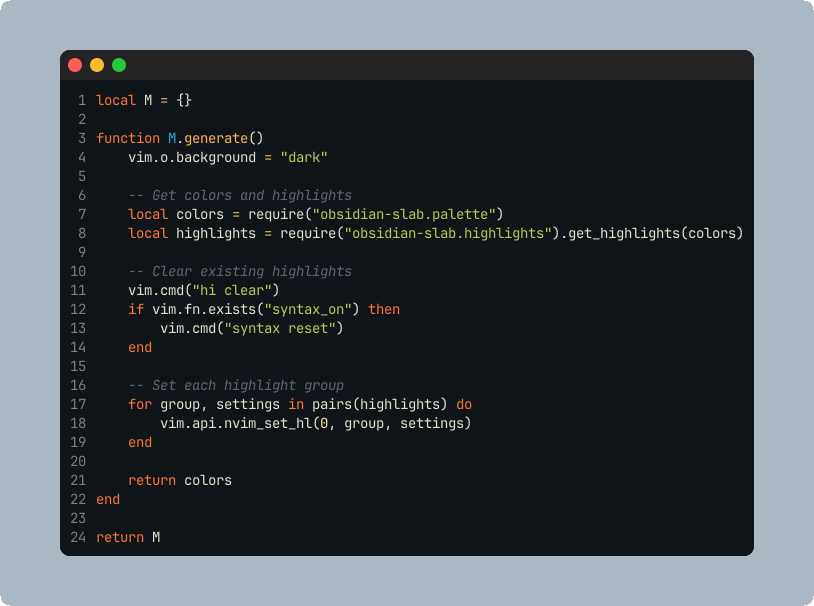
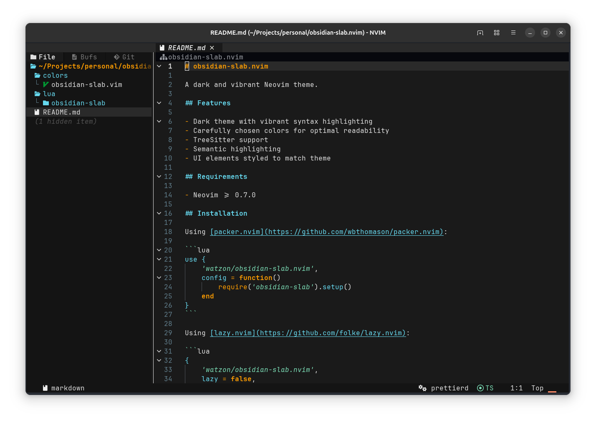

# obsidian-slab.nvim

A dark and vibrant Neovim theme.

<div align="center">
  
</div>

## Features

- Dark theme with vibrant syntax highlighting
- Carefully chosen colors for optimal readability
- TreeSitter support
- Semantic highlighting
- UI elements styled to match theme

## Requirements

- Neovim >= 0.7.0

## Installation

Using [packer.nvim](https://github.com/wbthomason/packer.nvim):

```lua
use {
    'watzon/obsidian-slab.nvim',
    config = function()
        require('obsidian-slab').setup()
    end
}
```

Using [lazy.nvim](https://github.com/folke/lazy.nvim):

```lua
{
    'watzon/obsidian-slab.nvim',
    lazy = false,
    priority = 1000,
    opts = {},
}
```

## Usage

Add to your init.lua:

```lua
-- Load the colorscheme
require('obsidian-slab').setup()
```

Or using Vim commands:

```vim
:colorscheme obsidian-slab
```

## Colors

- Background: `#1A1A1A`
- Foreground: `#E0E0E0`
- Comments: `#607D8B`
- Strings: `#7BDCB5`
- Keywords: `#FF9D00`
- Functions: `#66D9EF`
- Variables: `#B39DDB`
- Numbers: `#FFB7B7`
- Types: `#FF8A65`

## Screenshots



## License

MIT
